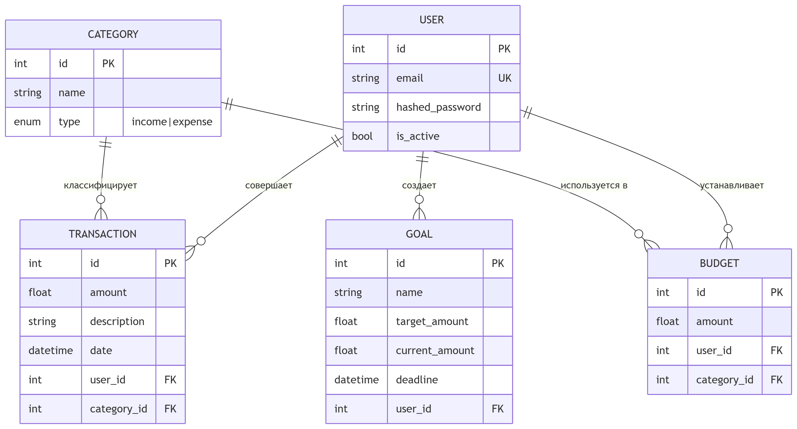

# finance_api
Система управления персональными финансами

### Описание
FastAPI-приложение для управления личными финансами с возможностью:
- 📊 Учёта транзакций (доходы/расходы)
- 🗂 Категоризации операций
- 💰 Установки бюджетов по категориям
- 🎯 Постановки финансовых целей
- 📈 Аналитики расходов через API

### Технологии
| Компонент       | Версия    |
|-----------------|----------|
| Python          | 3.9+     |
| FastAPI         | 0.115.12 |
| PostgreSQL      | 13       |
| SQLAlchemy      | 2.0.40   |
| JWT Auth        | python-jose 3.4.0 |

### Структура БД
БД включает в себя 5 таблиц для хранения данных пользователя, категорий, транзакций, бюджета и целей.
Связь сущностей представлена на диаграмме: 


### Запуск проекта
```bash
# 0. Дополнительная настройка окружения не требуется
# В проекте настроены конфигурационные файлы 
# .env, 
# docker-compose.yml,
# Dockerfile

# 1. Запуск через Docker
docker-compose up --build

# 2. API будет доступно на:
# - http://localhost:8000
# - Документация(SwaggerUI): http://localhost:8000/docs

# 3. Очистка контейнера
docker-compose down -v
```

### Порядок действий после запуска проекта
1. Регистрация пользователя
    * Задать почту и пароль
2. Аутентификация 
    * Получить токен доступа по заданным почте и паролю
    * Токен действителен 30 минут
3. Авторизация
    * Ввести почту и пароль
    * После этого пункта станут доступны все остальные возможности сервиса
4. Создание категорий
    * Для создания категории нужно задать: 
      * Имя категории 
      * Тип категории (income/expense)
    * После создания категории становится возможным:
      * Прочитать категорию по id
      * Прочитать все категории
      * Обновить уже имеющеюся категорию
      * Удалить категорию
5. Создание транзакции
    * Для создания транзакции нужно задать:
      * Сумму транзакции
      * Описание
      * Дату
      * id категории
    * После создания транзакции становится возможным:
      * Прочитать транзакцию по id
      * Прочитать транзакции по заданной категории (category_id)
      * Прочитать транзакции за заданный период времени
      * Обновить данные о транзакции
      * Удалить транзакцию
6. Создание бюджета
   * Для создания бюджета нужно:
     * Указать сумму бюджета
     * Указать категорию (category_id)
   * После создания бюджета становится возможным:
     * Прочитать бюджет по id
     * Прочитать все бюджеты
     * Изменить данные уже созданного бюджета
     * Удалить бюджет
7. Создание цели
   * Для создания цели нужно:
     * Указать название
     * Указать целевую сумму
     * Указать дедлайн
   * После создания цели становится возможным:
     * Прочитать цель по id
     * Прочитать все цели, а также активные/неактивные на текущую дату
     * Изменить цель
     * Обновить прогресс цели
     * Удалить цель
8. Использование аналитического функционала сервиса
   * Демонстрация затрат
     * Пользователь указывает временной период и категорию
     * На выходе пользователь видит: 
       * Итоговую потраченную сумму за указанный период по указанной категории
       * Данные о категории
       * Сравнение затрат по категории с бюджетом в этой категории
       * Указанные временные рамки сравнения
   * Сравнения доходов и затрат
     * Пользователь указывает временной период
     * На выходе пользователь получает:
       * Доходы за указанный период
       * Расходы за указанный период
       * Рейтинг сбережений за указанный период: $[(Д - Р) / Д] \cdot 100\%$
       * Период
   * Финансовое здоровье
     * Пользователь указывает количество месяцев $N$
     * На выходе пользователь получает:
       * Характеристику доходов и расходов за последние $N$ месяцев
       * Прогресс цели с указанием количества дней до дедлайна
       * Временной период для анализа

### Тестирование
Для запуска тестов необходимо выполнить команду:
```bash
docker-compose -f app/tests/docker-compose.yml up --build --abort-on-container-exit
```